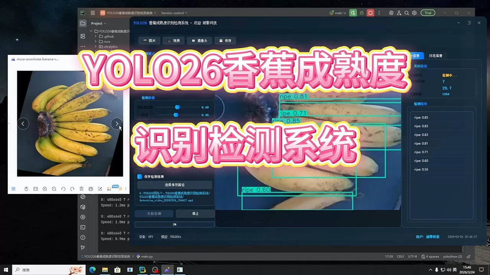
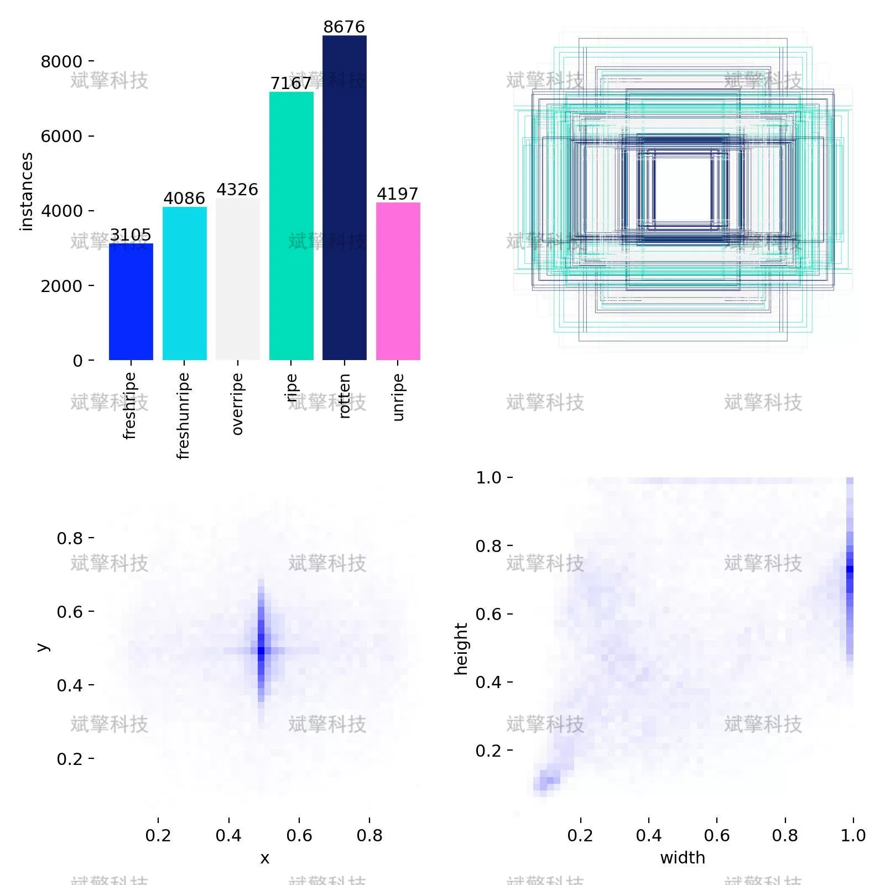
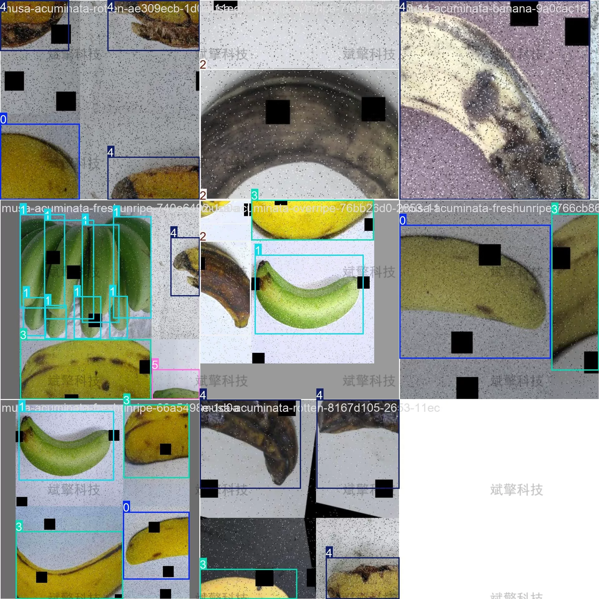
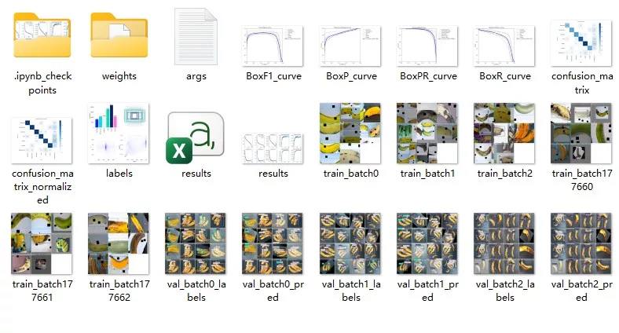
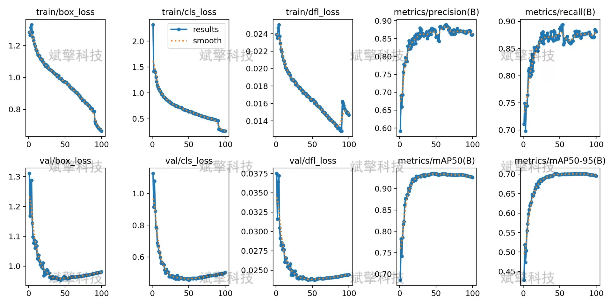
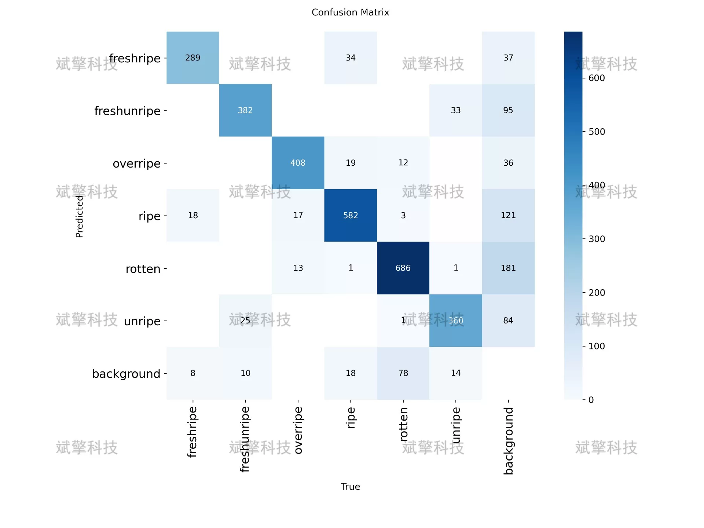
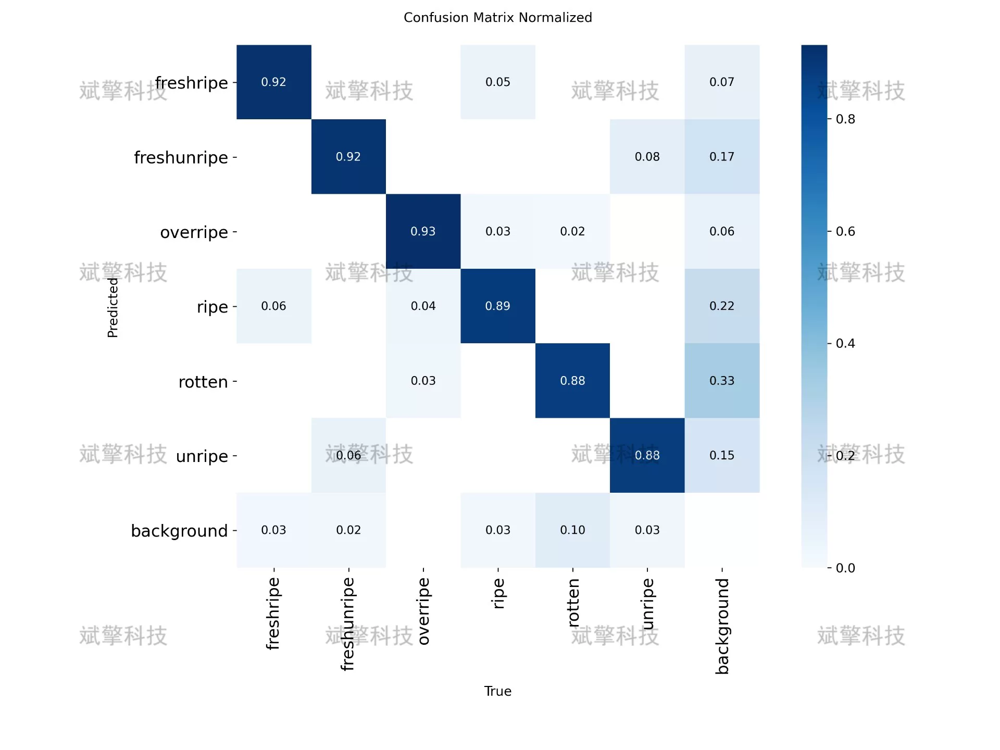
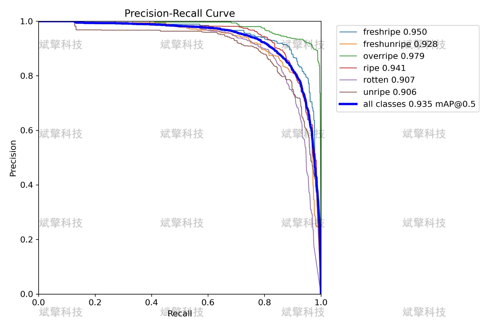

# YOLOv26 Banana Maturity Detection System | Source Code

## Body

YOLO26 Banana Maturity Detection System | Source Code: YOLO26 Aids in New Agricultural Breakthroughs: A six-class banana maturity recognition system with an mAP50 of 0.935 (Project Source Code + Dataset + Model Weights + UI Interface + Python + Deep Learning + Remote Environment Deployment)

The recognition of banana maturity is of great significance in agricultural production, post-harvest processing, and retail sectors. Traditional manual identification methods are subjective and inefficient, failing to meet the needs for precision management on a large scale. This study builds a smart recognition detection system for banana maturity based on the YOLO26 object detection algorithm, capable of automatically recognizing six types of banana maturity states: fresh ripe (freshripe), fresh unripe (freshunripe), overripe (overripe), ripe (ripe), rotten (rotten), and unripe (unripe). The system was trained using a total of 18,074 banana images, including 15,792 training images, 1,525 validation images, and 757 test images. The experimental results show that the model achieves an mAP50 of 0.935 on the test set, with both mAP50-95 also reaching 0.95, with precision and recall rates above 0.90, demonstrating excellent detection performance. The confusion matrix analysis indicates that the model can distinguish various maturity stages well, with only a small number of confusions occurring between adjacent maturity stages, which aligns with the continuous change in maturity characteristics in real scenarios. This system can provide effective technical support for intelligent management in the banana industry chain.

The dataset covers six types of banana maturity states, namely:
freshripe, fresh ripe, skin bright yellow with a green tip, flesh full and elastic
freshunripe, fresh unripe, skin mainly green with turning yellow, texture hard
overripe, overripe, large brown spots on the skin, soft pulp, possible sugar spots
ripe, ripe, uniform yellow skin with brown spots, optimal eating state
rotten, rotten, black skin with softened pulp and possible mold
unripe, unripe, green skin with firm texture, not yet turning color

Free reservation for remote installation. Unsuccessful installation will result in a full refund.
Purchase comes with the following resources (Google Drive auto-locked):
- YOLO recognition detection project complete source code
- YOLO format dataset
- Training code + UI interface code
- Trained model + results image
- Software installer
- Add WeChat reservation for remote installation (automatically displayed WeChat ID after purchase) - Unsuccessful, full refund

⚙️ Core Functional Modules
Detection Capabilities
- Image detection: upload and detect, return detection boxes + category information
- Video detection: supports video files, analyzes frames accurately
- Camera real-time detection: connects USB camera for dynamic monitoring
Interaction and Control
- Target filtering: freely select one or more categories for detection
- Parameter adjustment: adjustable confidence threshold & IoU threshold, flexible control accuracy
- Results saving: save images/videos/camera detection results in one click
System and Data
- User login registration: supports password strength checking + encryption storage
- Log recording: automatically records operation and error information (timestamped)

## Images

## Payment

Here is a pay link on Stripe ( https://buy.stripe.com/3cs8yP7sY87d0vu9AB ). Please contact me lonlonago@foxmail.com after funding $89, and I will send you a complete data files , thank you!

